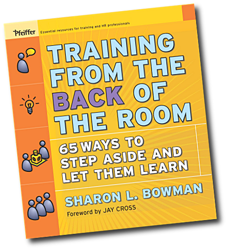
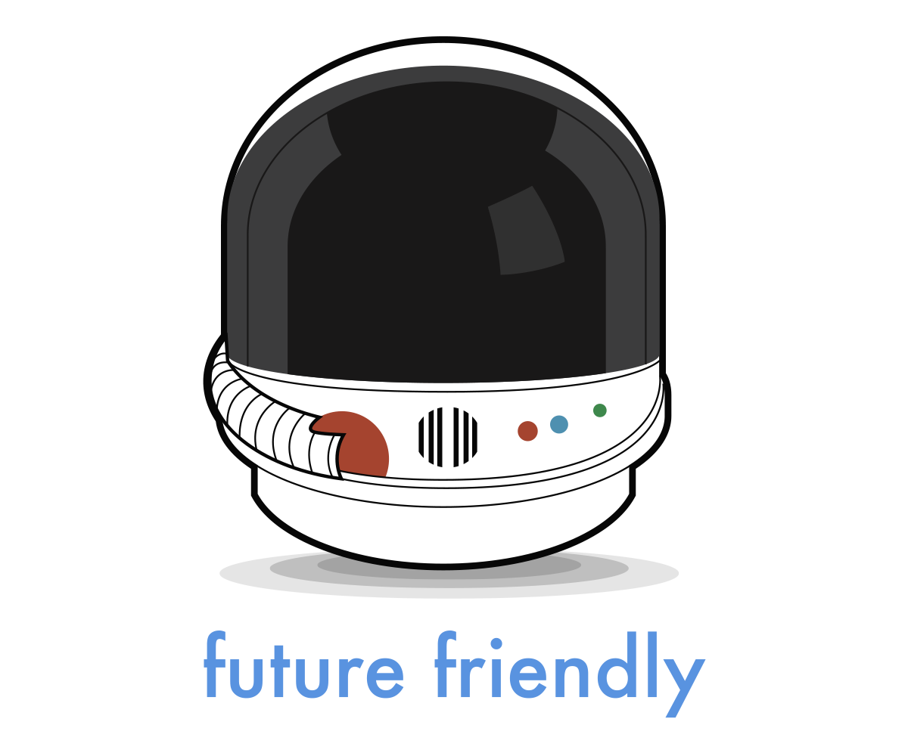
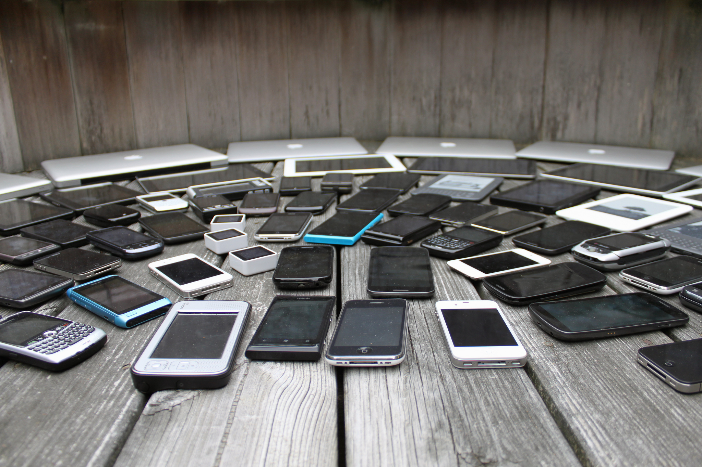
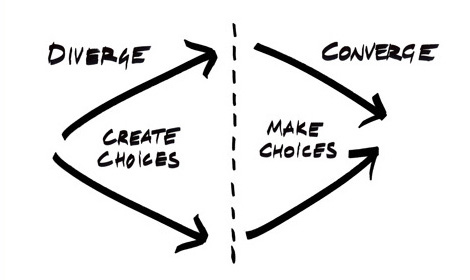

# FF UX :fire:

^ Steve
Other FF talk, w/s: AI, IoT, near future, high tech. This is longer term, lower tech.
How many do you give about your users?

---

### Goals for the day

## Identify your specific **Problems** and **Patterns**

^ Steve

---

### Goals for the day

## Make your own list of Future Friendly UX **Principles**

^ Steve

---

### Goals for the day

## Start sketching out **Solutions**

^ Steve

---

### Agenda

## Breaks at 2pm, 3pm, 4pm

---

^ Steve
Sharon Bowman
Training From The Back Of The Room

---

# Problems

^ Justin
The assumptions we make that date, sometimes very quickly.
The things we don't know.

---

# Patterns

^ Justin
The patterns that show these assumptions.

---

# Principles

^ Justin
Principles we can follow to avoid the Problems and Patterns.
Not rules: guidelines and suggestions.

---

# Solutions

^ Justin
Specific, practical, new Patterns we can use to avoid these Problems.

---

## What is Future Friendly UX design?

^ Justin
Being careful about the assumptions we make
Designing for change, unknowns

---

^ Justin
Big names in Mobile, Responsive, UX (Luke Wroblewski, Scott Jenson, Brad Frost, Jeremy Keith, Lyza D. Gardner, Scott Jehl, Stephanie Rieger, Josh Clark, ...)
This png is not future friendly :)

---

## futurefriend.ly

^ Steve
This is the world now

---

## The **quantity** and **diversity** of connected **devices** is increasing.

---

## The quantity and diversity of connected devices, **and the people that use them**, is increasing.

^ Steve
New audiences
Never been connected before
Mobile-only

---

## 1. acknowledge and embrace unpredictability

^ Steve
We can deal with this exciting, overwhelming, world by:

---

## 2. think and behave in a future friendly way

^ Steve

---

## 3. help others to do the same.

^ Steve

---

## Future Friendly
## Principles

^ Justin

---

### Future Friendly Principles

# Focus

^ * more people, more channels
* less time, less attention
* relevant, high quality, content, delivered fast

^ Justin

---

### Future Friendly Principles

# Content

^ * it could go anywhere
* start with well-structured HTML
* Progressive Enhancement to layer on presentation
* Progressive Enhancement to layer on behaviour

^ Justin

---

### Future Friendly Principles

# Devices

^ * make some best guesses
* high-level, good-enough, classifications for devices
* play to the strengths and unique capabilities of devices

^ Justin

---

# It's a Mission

^ * long term approach
* guided by principles

^ Justin

---

### Future Friendly UX Design

## An example

^ Steve
How we're going to do it today

---

### Problem

## Assumptions about
## user's interest

^ Steve
in *all* our stuff

---

### Pattern

## Carousel ಠ_ಠ

^ Steve
Probably auto-playing
Probably 5+ slides

---

### Principle

## Focus

^ Steve

---

---

### Solution

## Single hero image
## Random on page load

^ Steve

---

## Questions / queries?

^ Justin