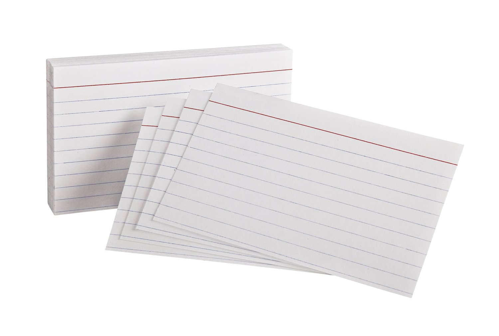

### Write down someone else's answers to the warm-up questions

### (What was the first thing you worked on?)
### (What changes in the tech landscape have there been since then?)

---

## Write down changes in the tech landscape in the past few years

---

## (Short!) Presentation

---

## Walk around and write on the posters

---

## Make a summary of the posters

^ Will do short share with room after

---

## Share one sentence each about
## Problems, Patterns, and Principles

---

### Break
## Write any questions on the ? poster

^ We'll answer after the break

---

## Q?
## A!

---

## Popular Patterns
### What Problems do they have?
### What Principles can we apply?
### What assumptions are we making?

---

## Sketch your
## Future Friendly UX
## Solutions

^ Diverge, then converge
create choices, then make choices

---

## Pick a Pattern
## Identify the Problems

---

## Sketch out many ideas
## Quantity over Quality

^ On your own

---

## Dot vote
## To the left

^ Grab a pen, stand up
Move one seat to the left
Dot vote
Repeat

---

### 1 sentence for:
## Your Pattern, Problem
## Your Solution
## Which Principles

---

## Sketch
## Iterate on most-voted

---

### On the front:
## your SMART goal.
### On the back:
## your details.
## Swap with a buddy.

---

### Two promises
### email tomorrow with reminder
### email to check SMART goal done

----

## Facilitator Feedback

## One thing we could do differently

