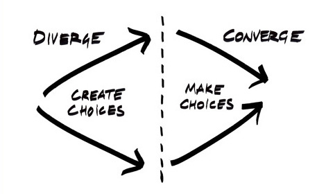

### Write down someone else's answers to the warm-up questions

### (What was the first thing you worked on?)
### (What changes in the tech landscape have there been since then?)

---

## Combine the answers
## Look for themes

---

## Talk at the wall:
## Changes

---

## (Short!) Presentation

---

## Talk at the wall:
## Patterns

---

## Walk around and write
## (at least) one thing
## on each poster

^ Problem, Pattern, Principle

---

## Make a summary of the posters

^ Will do short share with room after

---

## Share one sentence each about
## Problems, Patterns, and Principles

---

## Sketch your
## Future Friendly UX
## Solutions

^ Diverge, then converge
create choices, then make choices

---

---

## Pick a Pattern
## Identify the Problems

---

### Break
## Write any questions on the ? poster

^ We'll answer after the break

---

## Answers to
## your questions

---

## Sketch out many ideas
## Quantity over Quality

^ On your own

---

## vote "X"
## To the left

^ FF Principles
Grab a pen, stand up
Move one seat to the left
Dot vote
Repeat

---

### 1 sentence recap for:
## Your Pattern, Problem
## Your Solution
## Which Principles

---

## Sketch
## Iterate on most-voted

---

### On the front:
## your SMART goal.
### On the back:
## your details.
## Swap with a buddy.

---

### Two promises
### email tomorrow with reminder
### email to check SMART goal done

----

## Facilitator Feedback

## One thing we could do differently

----

## ctfeds.org/ffux